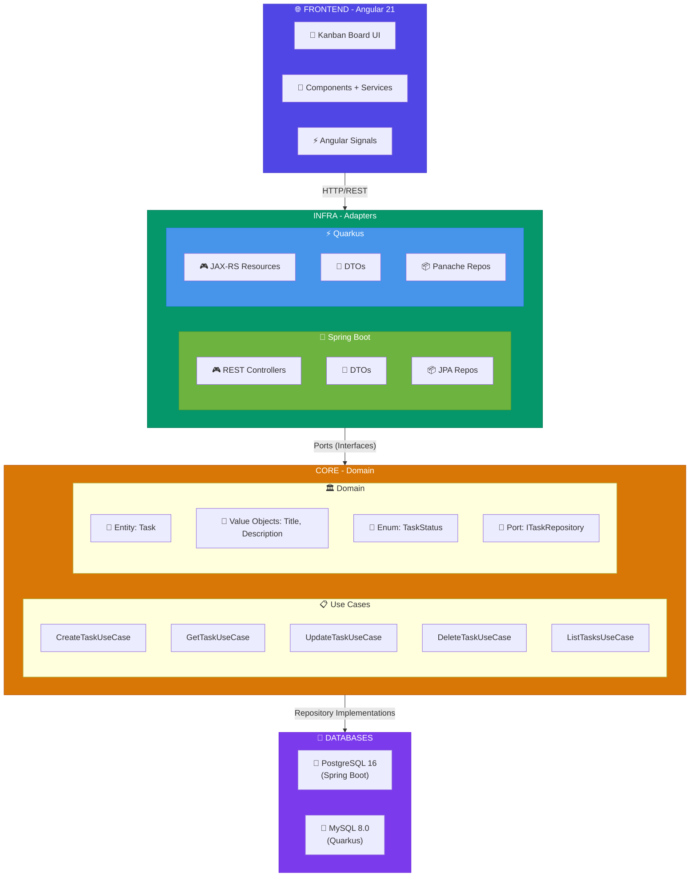
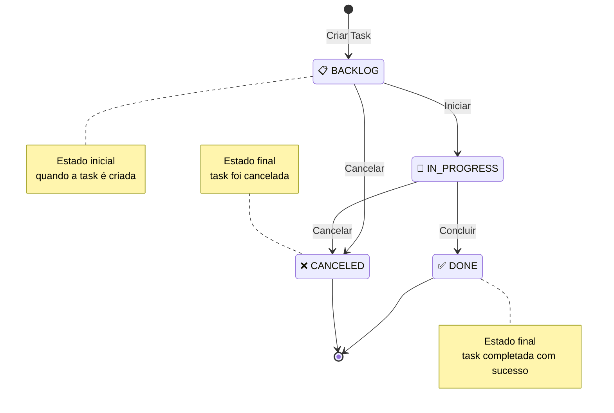
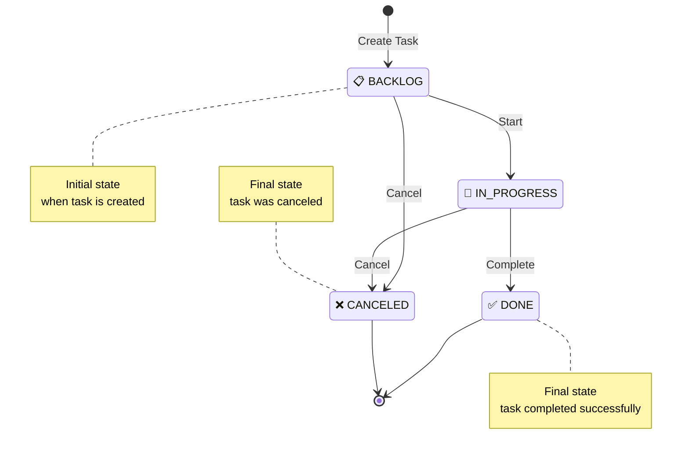
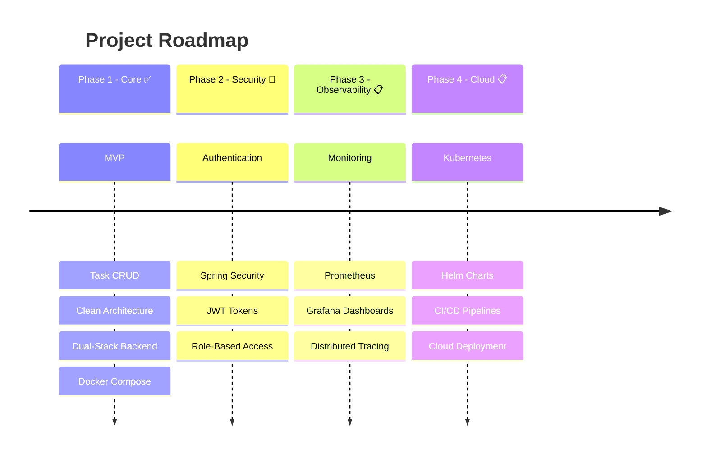

<div align="center">

<!-- Animated Header -->


<!-- Language Toggle -->
<a href="#português-">
  
</a>
<a href="#english-">
  
</a>

<br/><br/>

<!-- Animated Typing -->
<a href="https://git.io/typing-svg">
  
</a>
<br/><br/>
<br/>

<!-- Tech Badges -->
<p>
  
  
  
  
  
</p>

<p>
  
  
  
  
</p>

<!-- Status Badges -->
<p>
  
  
  
  
</p>

</div>

---

<!-- TABLE OF CONTENTS -->
<details open>
<summary><b>📑 Índice / Table of Contents</b></summary>

| 🇧🇷 Português | 🇺🇸 English |
|:-------------:|:-----------:|
| [Sobre o Projeto](#-sobre-o-projeto) | [About the Project](#-about-the-project) |
| [Arquitetura](#%EF%B8%8F-arquitetura) | [Architecture](#%EF%B8%8F-architecture) |
| [Tecnologias](#-tecnologias) | [Technologies](#-technologies) |
| [Funcionalidades](#-funcionalidades) | [Features](#-features) |
| [Estrutura do Projeto](#-estrutura-do-projeto) | [Project Structure](#-project-structure) |
| [Início Rápido](#-início-rápido) | [Quick Start](#-quick-start) |
| [Documentação da API](#-documentação-da-api) | [API Documentation](#-api-documentation) |
| [Testes](#-testes) | [Testing](#-testing) |
| [Roadmap](#-roadmap) | [Roadmap](#-roadmap-1) |
| [Contribuindo](#-contribuindo) | [Contributing](#-contributing) |
| [Autor](#-autor) | [Author](#-author) |

</details>

---

<br/>

<!-- ==================== PORTUGUÊS ==================== -->

<div align="center">
  

  # Português 🇧🇷
</div>

## 📋 Sobre o Projeto

<div align="center">
  
</div>

<br/>

> 🎯 **To-Do App** é uma aplicação completa de gerenciamento de tarefas que demonstra a implementação profissional de **Clean Architecture**, **Domain-Driven Design (DDD)** e **Arquitetura Hexagonal** com containerização Docker completa.

<br/>

### ✨ Destaques

<table>
<tr>
<td width="50%">

🏗️ **Arquitetura Enterprise-Grade**
- Clean Architecture com camadas bem definidas
- Hexagonal Architecture (Ports & Adapters)
- Domain-Driven Design completo
- Princípios SOLID aplicados

</td>
<td width="50%">

🔄 **Dual-Stack Backend**
- Spring Boot 3.2.5 + PostgreSQL
- Quarkus 3.30.5 + MySQL
- Mesmo domínio, diferentes frameworks
- Prova de independência de framework

</td>
</tr>
<tr>
<td width="50%">

🎨 **Frontend Moderno**
- Angular 21 com Standalone Components
- Angular Signals para reatividade
- PrimeNG para UI rica
- Kanban Board interativo

</td>
<td width="50%">

🐳 **DevOps Ready**
- Docker Compose com profiles
- Multi-stage builds otimizados
- Health checks automáticos
- Orquestração de serviços

</td>
</tr>
</table>

<br/>

## 🏛️ Arquitetura

<div align="center">
  
</div>

<br/>

### 🎯 Visão Geral da Arquitetura



<br/>

### 🔄 Fluxo de Status das Tasks



<table>
<tr>
<td>

**✅ Transições Permitidas**
- `BACKLOG` → `IN_PROGRESS`
- `BACKLOG` → `CANCELED`
- `IN_PROGRESS` → `DONE`
- `IN_PROGRESS` → `CANCELED`

</td>
<td>

**❌ Estados Finais (sem transição)**
- `DONE`
- `CANCELED`

</td>
</tr>
</table>

<br/>

## 🛠 Tecnologias

<div align="center">
  
</div>

<br/>

<div align="center">

### Backend

| Tecnologia | Versão | Descrição |
|:----------:|:------:|:----------|
|  | 21 LTS | Linguagem principal |
|  | 3.2.5 | Framework backend (Stack 1) |
|  | 3.30.5 | Framework backend (Stack 2) |
|  | 16 | Banco de dados (Spring) |
|  | 8.0 | Banco de dados (Quarkus) |
|  | - | ORM/JPA |

### Frontend

| Tecnologia | Versão | Descrição |
|:----------:|:------:|:----------|
|  | 21 | Framework frontend |
|  | 5.9 | Linguagem tipada |
|  | 21 | Biblioteca de componentes |
|  | - | Pré-processador CSS |

### DevOps & Infraestrutura

| Tecnologia | Versão | Descrição |
|:----------:|:------:|:----------|
|  | - | Containerização |
|  | 1.25 | Proxy reverso |
|  | 3 | Build tool (Backend) |
|  | 10.9 | Package manager (Frontend) |

</div>

<br/>

## ✨ Funcionalidades

<div align="center">
  
</div>

<br/>

<div align="center">

| Funcionalidade | Descrição | Status |
|:--------------|:----------|:------:|
| 📝 **Criar Tarefas** | Adicione tarefas com título e descrição | ✅ |
| 📋 **Listar Tarefas** | Visualize todas as tarefas organizadas por status | ✅ |
| ✏️ **Editar Tarefas** | Atualize título, descrição e status | ✅ |
| 🗑️ **Excluir Tarefas** | Soft delete com status CANCELED | ✅ |
| 🎯 **Kanban Board** | Interface drag-and-drop interativa | ✅ |
| 🔄 **Drag & Drop** | Mova tarefas entre colunas de status | ✅ |
| 📱 **Responsivo** | Layout adaptável para diferentes telas | ✅ |
| 🔔 **Notificações** | Toast messages para feedback de ações | ✅ |
| 📚 **API Docs** | Swagger/OpenAPI integrado | ✅ |
| 🏥 **Health Checks** | Monitoramento de saúde dos serviços | ✅ |
| 🔐 **Autenticação** | Spring Security + JWT | 🚧 |
| 📊 **Dashboard** | Métricas e analytics | 📋 |

</div>

**Legenda:** ✅ Concluído | 🚧 Em Desenvolvimento | 📋 Planejado

<br/>

## 📁 Estrutura do Projeto

<div align="center">
  
</div>

<br/>

```
📦 to-do-app-clean-arch
 ┣ 📂 to-do-app-backend
 ┃ ┗ 📂 to-do-app-backend
 ┃   ┣ 📂 to-do-app-core             # 💎 Domínio (Framework-Agnostic)
 ┃   ┃ ┗ 📂 src/main/java
 ┃   ┃   ┗ 📂 com/mello/todoappcore/task
 ┃   ┃     ┣ 📂 domain
 ┃   ┃     ┃ ┣ 📂 entities           # 📌 Task Entity
 ┃   ┃     ┃ ┣ 📂 vo                 # 💎 Value Objects (Title, Description)
 ┃   ┃     ┃ ┗ 📂 enums              # 🔄 TaskStatus
 ┃   ┃     ┣ 📂 ports                # 🚪 ITaskRepository (Outbound Port)
 ┃   ┃     ┣ 📂 usecases             # 📋 Use Case Interfaces (Inbound Ports)
 ┃   ┃     ┃ ┗ 📂 impl               # 🔧 Use Case Implementations
 ┃   ┃     ┗ 📂 exceptions           # ⚠️ Domain Exceptions
 ┃   ┃
 ┃   ┣ 📂 to-do-app-infra-spring     # 🍃 Spring Boot Adapter
 ┃   ┃ ┗ 📂 src/main/java
 ┃   ┃   ┗ 📂 com/mello/todoappinfra
 ┃   ┃     ┣ 📂 configuration        # ⚙️ Spring Config, CORS, OpenAPI
 ┃   ┃     ┗ 📂 task
 ┃   ┃       ┣ 📂 rest/controllers   # 🎮 REST Controllers
 ┃   ┃       ┣ 📂 rest/dto           # 📝 Request/Response DTOs
 ┃   ┃       ┣ 📂 persistence        # 💾 JPA Entities & Repositories
 ┃   ┃       ┗ 📂 mappers            # 🔄 Domain ↔ DTO Converters
 ┃   ┃
 ┃   ┗ 📂 to-do-app-infra-quarkus    # ⚡ Quarkus Adapter
 ┃     ┗ 📂 src/main/java
 ┃       ┗ 📂 com/mello/todoappquarkus
 ┃         ┣ 📂 resources            # 🎮 JAX-RS Resources
 ┃         ┣ 📂 persistence          # 💾 JPA Entities & Repositories
 ┃         ┣ 📂 producers            # 🏭 CDI Producers
 ┃         ┗ 📂 mappers              # 🔄 Converters
 ┃
 ┣ 📂 to-do-app-web                  # 🌐 Frontend Angular
 ┃ ┣ 📂 src/app
 ┃ ┃ ┣ 📂 components                 # 🧩 UI Components
 ┃ ┃ ┃ ┣ 📂 header                   # 🔝 Header Component
 ┃ ┃ ┃ ┣ 📂 task-card                # 🎴 Task Card
 ┃ ┃ ┃ ┣ 📂 task-column              # 📊 Kanban Column
 ┃ ┃ ┃ ┗ 📂 task-form-dialog         # 📝 Create/Edit Dialog
 ┃ ┃ ┣ 📂 pages/home                 # 🏠 Main Page (Kanban Board)
 ┃ ┃ ┣ 📂 services                   # 🔌 API Services
 ┃ ┃ ┗ 📂 models                     # 📋 TypeScript Types
 ┃ ┣ 📜 nginx.conf                   # 🔧 Nginx Configuration
 ┃ ┗ 📜 Dockerfile                   # 🐳 Frontend Docker Build
 ┃
 ┣ 📜 docker-compose.yml             # 🐳 Service Orchestration
 ┣ 📜 .env.spring                    # ⚙️ Spring Environment
 ┣ 📜 .env.quarkus                   # ⚙️ Quarkus Environment
 ┗ 📜 README.md                      # 📖 This file!
```

<br/>

## 🚀 Início Rápido

<div align="center">
  
</div>

<br/>

### 📋 Pré-requisitos

<table>
<tr>
<td>

**🐳 Docker (Recomendado)**
- Docker Desktop 4.x+
- Docker Compose 2.x+

</td>
<td>

**💻 Desenvolvimento Local**
- Java 21 (JDK)
- Node.js 20+
- Maven 3.9+

</td>
</tr>
</table>

<br/>

### 🐳 Execução com Docker (Recomendado)

<details open>
<summary><b>🍃 Stack Spring Boot + PostgreSQL</b></summary>

```bash
# Clone o repositório
git clone https://github.com/seu-usuario/to-do-app-clean-arch.git
cd to-do-app-clean-arch

# Inicie os serviços
docker-compose --profile spring --env-file .env.spring up -d

# Acompanhe os logs
docker-compose --profile spring logs -f

# Pare os serviços
docker-compose --profile spring down
```

**🌐 URLs:**
| Serviço | URL |
|---------|-----|
| 📱 Frontend | http://localhost |
| 🔌 Backend API | http://localhost:8080 |
| 📚 Swagger UI | http://localhost:8080/swagger-ui.html |
| 🏥 Health Check | http://localhost:8080/actuator/health |
| 🐘 pgAdmin | http://localhost:5050 |

</details>

<details>
<summary><b>⚡ Stack Quarkus + MySQL</b></summary>

```bash
# Inicie os serviços
docker-compose --profile quarkus --env-file .env.quarkus up -d

# Acompanhe os logs
docker-compose --profile quarkus logs -f

# Pare os serviços
docker-compose --profile quarkus down
```

**🌐 URLs:**
| Serviço | URL |
|---------|-----|
| 📱 Frontend | http://localhost |
| 🔌 Backend API | http://localhost:8080 |
| 🏥 Health Check | http://localhost:8080/q/health |
| 🐬 Adminer | http://localhost:8081 |

</details>

<br/>

### 💻 Execução Local (Desenvolvimento)

<details>
<summary><b>🔧 Backend (Spring Boot)</b></summary>

```bash
# Entre no diretório do backend
cd to-do-app-backend/to-do-app-backend

# Compile o projeto
./mvnw clean install

# Inicie o PostgreSQL (via Docker)
docker-compose --profile spring up postgres -d

# Execute o backend
./mvnw spring-boot:run -pl to-do-app-infra-spring
```

</details>

<details>
<summary><b>🎨 Frontend (Angular)</b></summary>

```bash
# Entre no diretório do frontend
cd to-do-app-web

# Instale as dependências
npm install

# Execute em modo desenvolvimento
npm start
```

Acesse: http://localhost:4200

</details>

<br/>

## 📖 Documentação da API

<div align="center">
  
</div>

<br/>

### 📝 Endpoints

| Método | Endpoint | Descrição | Request Body |
|:------:|:---------|:----------|:-------------|
| `POST` | `/api/task/create` | Criar nova tarefa | `{ "title": "string", "description": "string" }` |
| `GET` | `/api/task/{id}` | Buscar tarefa por ID | - |
| `GET` | `/api/task/all` | Listar todas as tarefas | - |
| `PUT` | `/api/task/{id}` | Atualizar tarefa | `{ "title": "string", "description": "string", "status": "enum" }` |
| `DELETE` | `/api/task/{id}` | Excluir tarefa (soft delete) | - |

<br/>

### 📊 Exemplos de Requisições

<details>
<summary><b>➕ Criar Tarefa</b></summary>

```bash
curl -X POST http://localhost:8080/api/task/create \
  -H "Content-Type: application/json" \
  -d '{
    "title": "Implementar autenticação",
    "description": "Adicionar Spring Security com JWT"
  }'
```

**Response (201 Created):**
```json
{
  "id": "550e8400-e29b-41d4-a716-446655440000",
  "title": "Implementar autenticação",
  "description": "Adicionar Spring Security com JWT",
  "status": "BACKLOG",
  "createdAt": "2025-01-17T10:30:00Z"
}
```

</details>

<details>
<summary><b>🔄 Atualizar Status</b></summary>

```bash
curl -X PUT http://localhost:8080/api/task/550e8400-e29b-41d4-a716-446655440000 \
  -H "Content-Type: application/json" \
  -d '{
    "title": "Implementar autenticação",
    "description": "Adicionar Spring Security com JWT",
    "status": "IN_PROGRESS"
  }'
```

</details>

<br/>

## 🧪 Testes

<div align="center">
  
</div>

<br/>

### 🔬 Backend Tests

```bash
# Executar todos os testes
./mvnw test

# Executar apenas testes do core (domínio)
./mvnw test -pl to-do-app-core

# Executar com cobertura (se configurado)
./mvnw test jacoco:report
```

**Tipos de Testes:**
- ✅ **Unit Tests**: Entidade Task, Value Objects, Use Cases
- ✅ **Integration Tests**: REST Controllers, Repositories
- ✅ **Fake Repository**: Implementação em memória para testes isolados

### 🎨 Frontend Tests

```bash
cd to-do-app-web

# Executar testes unitários
npm test

# Executar com coverage
npm run test:coverage
```

<br/>

## 🗺 Roadmap

<div align="center">
  
</div>

<br/>


<br/>

### 📋 Próximas Funcionalidades

- [ ] 🔐 **Autenticação & Autorização** - Spring Security + JWT
- [ ] 📊 **Dashboard Analytics** - Métricas de produtividade
- [ ] 🔔 **Notificações Push** - WebSocket integration
- [ ] 📁 **Categorias/Tags** - Organização de tarefas
- [ ] 🔍 **Busca Avançada** - Filtros e ordenação
- [ ] 📱 **PWA** - Suporte offline
- [ ] 🌍 **i18n** - Internacionalização
- [ ] 📈 **Prometheus + Grafana** - Observabilidade
- [ ] ☸️ **Kubernetes** - Deploy em cluster

<br/>

## 🤝 Contribuindo

<div align="center">
  
</div>

<br/>

Contribuições são **muito bem-vindas**! 🎉

1. Faça um Fork do projeto
2. Crie sua Feature Branch (`git checkout -b feature/AmazingFeature`)
3. Commit suas mudanças (`git commit -m 'Add some AmazingFeature'`)
4. Push para a Branch (`git push origin feature/AmazingFeature`)
5. Abra um Pull Request

<br/>

## 👤 Autor

<div align="center">
  
</div>

<br/>

<div align="center">
  <a href="https://github.com/victordemello">
    
  </a>
  <a href="https://www.linkedin.com/in/mellodevictor/">
    
  </a>
</div>

<br/>

---

<br/>

<!-- ==================== ENGLISH ==================== -->

<div align="center">
  

  # English 🇺🇸
</div>

## 📋 About the Project

<div align="center">
  
</div>

<br/>

> 🎯 **To-Do App** is a complete task management application that demonstrates professional implementation of **Clean Architecture**, **Domain-Driven Design (DDD)**, and **Hexagonal Architecture** with full Docker containerization.

<br/>

### ✨ Highlights

<table>
<tr>
<td width="50%">

🏗️ **Enterprise-Grade Architecture**
- Clean Architecture with well-defined layers
- Hexagonal Architecture (Ports & Adapters)
- Complete Domain-Driven Design
- SOLID principles applied

</td>
<td width="50%">

🔄 **Dual-Stack Backend**
- Spring Boot 3.2.5 + PostgreSQL
- Quarkus 3.30.5 + MySQL
- Same domain, different frameworks
- Proof of framework independence

</td>
</tr>
<tr>
<td width="50%">

🎨 **Modern Frontend**
- Angular 21 with Standalone Components
- Angular Signals for reactivity
- PrimeNG for rich UI
- Interactive Kanban Board

</td>
<td width="50%">

🐳 **DevOps Ready**
- Docker Compose with profiles
- Optimized multi-stage builds
- Automatic health checks
- Service orchestration

</td>
</tr>
</table>

<br/>

## 🏛️ Architecture

<div align="center">
  
</div>

<br/>

### 🎯 Architecture Overview


<br/>

### 🔄 Task Status Flow



<table>
<tr>
<td>

**✅ Allowed Transitions**
- `BACKLOG` → `IN_PROGRESS`
- `BACKLOG` → `CANCELED`
- `IN_PROGRESS` → `DONE`
- `IN_PROGRESS` → `CANCELED`

</td>
<td>

**❌ Final States (no transitions)**
- `DONE`
- `CANCELED`

</td>
</tr>
</table>

<br/>

## 🛠 Technologies

<div align="center">
  
</div>

<br/>

<div align="center">

### Backend

| Technology | Version | Description |
|:----------:|:-------:|:------------|
|  | 21 LTS | Main language |
|  | 3.2.5 | Backend framework (Stack 1) |
|  | 3.30.5 | Backend framework (Stack 2) |
|  | 16 | Database (Spring) |
|  | 8.0 | Database (Quarkus) |
|  | - | ORM/JPA |

### Frontend

| Technology | Version | Description |
|:----------:|:-------:|:------------|
|  | 21 | Frontend framework |
|  | 5.9 | Typed language |
|  | 21 | Component library |
|  | - | CSS preprocessor |

### DevOps & Infrastructure

| Technology | Version | Description |
|:----------:|:-------:|:------------|
|  | - | Containerization |
|  | 1.25 | Reverse proxy |
|  | 3 | Build tool (Backend) |
|  | 10.9 | Package manager (Frontend) |

</div>

<br/>

## ✨ Features

<div align="center">
  
</div>

<br/>

<div align="center">

| Feature | Description | Status |
|:--------|:------------|:------:|
| 📝 **Create Tasks** | Add tasks with title and description | ✅ |
| 📋 **List Tasks** | View all tasks organized by status | ✅ |
| ✏️ **Edit Tasks** | Update title, description and status | ✅ |
| 🗑️ **Delete Tasks** | Soft delete with CANCELED status | ✅ |
| 🎯 **Kanban Board** | Interactive drag-and-drop interface | ✅ |
| 🔄 **Drag & Drop** | Move tasks between status columns | ✅ |
| 📱 **Responsive** | Adaptive layout for different screens | ✅ |
| 🔔 **Notifications** | Toast messages for action feedback | ✅ |
| 📚 **API Docs** | Integrated Swagger/OpenAPI | ✅ |
| 🏥 **Health Checks** | Service health monitoring | ✅ |
| 🔐 **Authentication** | Spring Security + JWT | 🚧 |
| 📊 **Dashboard** | Metrics and analytics | 📋 |

</div>

**Legend:** ✅ Completed | 🚧 In Development | 📋 Planned

<br/>

## 📁 Project Structure

<div align="center">
  
</div>

<br/>

```
📦 to-do-app-clean-arch
 ┣ 📂 to-do-app-backend
 ┃ ┗ 📂 to-do-app-backend
 ┃   ┣ 📂 to-do-app-core             # 💎 Domain (Framework-Agnostic)
 ┃   ┃ ┗ 📂 src/main/java
 ┃   ┃   ┗ 📂 com/mello/todoappcore/task
 ┃   ┃     ┣ 📂 domain
 ┃   ┃     ┃ ┣ 📂 entities           # 📌 Task Entity
 ┃   ┃     ┃ ┣ 📂 vo                 # 💎 Value Objects (Title, Description)
 ┃   ┃     ┃ ┗ 📂 enums              # 🔄 TaskStatus
 ┃   ┃     ┣ 📂 ports                # 🚪 ITaskRepository (Outbound Port)
 ┃   ┃     ┣ 📂 usecases             # 📋 Use Case Interfaces (Inbound Ports)
 ┃   ┃     ┃ ┗ 📂 impl               # 🔧 Use Case Implementations
 ┃   ┃     ┗ 📂 exceptions           # ⚠️ Domain Exceptions
 ┃   ┃
 ┃   ┣ 📂 to-do-app-infra-spring     # 🍃 Spring Boot Adapter
 ┃   ┃ ┗ 📂 src/main/java
 ┃   ┃   ┗ 📂 com/mello/todoappinfra
 ┃   ┃     ┣ 📂 configuration        # ⚙️ Spring Config, CORS, OpenAPI
 ┃   ┃     ┗ 📂 task
 ┃   ┃       ┣ 📂 rest/controllers   # 🎮 REST Controllers
 ┃   ┃       ┣ 📂 rest/dto           # 📝 Request/Response DTOs
 ┃   ┃       ┣ 📂 persistence        # 💾 JPA Entities & Repositories
 ┃   ┃       ┗ 📂 mappers            # 🔄 Domain ↔ DTO Converters
 ┃   ┃
 ┃   ┗ 📂 to-do-app-infra-quarkus    # ⚡ Quarkus Adapter
 ┃     ┗ 📂 src/main/java
 ┃       ┗ 📂 com/mello/todoappquarkus
 ┃         ┣ 📂 resources            # 🎮 JAX-RS Resources
 ┃         ┣ 📂 persistence          # 💾 JPA Entities & Repositories
 ┃         ┣ 📂 producers            # 🏭 CDI Producers
 ┃         ┗ 📂 mappers              # 🔄 Converters
 ┃
 ┣ 📂 to-do-app-web                  # 🌐 Frontend Angular
 ┃ ┣ 📂 src/app
 ┃ ┃ ┣ 📂 components                 # 🧩 UI Components
 ┃ ┃ ┃ ┣ 📂 header                   # 🔝 Header Component
 ┃ ┃ ┃ ┣ 📂 task-card                # 🎴 Task Card
 ┃ ┃ ┃ ┣ 📂 task-column              # 📊 Kanban Column
 ┃ ┃ ┃ ┗ 📂 task-form-dialog         # 📝 Create/Edit Dialog
 ┃ ┃ ┣ 📂 pages/home                 # 🏠 Main Page (Kanban Board)
 ┃ ┃ ┣ 📂 services                   # 🔌 API Services
 ┃ ┃ ┗ 📂 models                     # 📋 TypeScript Types
 ┃ ┣ 📜 nginx.conf                   # 🔧 Nginx Configuration
 ┃ ┗ 📜 Dockerfile                   # 🐳 Frontend Docker Build
 ┃
 ┣ 📜 docker-compose.yml             # 🐳 Service Orchestration
 ┣ 📜 .env.spring                    # ⚙️ Spring Environment
 ┣ 📜 .env.quarkus                   # ⚙️ Quarkus Environment
 ┗ 📜 README.md                      # 📖 This file!
```

<br/>

## 🚀 Quick Start

<div align="center">
  
</div>

<br/>

### 📋 Prerequisites

<table>
<tr>
<td>

**🐳 Docker (Recommended)**
- Docker Desktop 4.x+
- Docker Compose 2.x+

</td>
<td>

**💻 Local Development**
- Java 21 (JDK)
- Node.js 20+
- Maven 3.9+

</td>
</tr>
</table>

<br/>

### 🐳 Running with Docker (Recommended)

<details open>
<summary><b>🍃 Spring Boot + PostgreSQL Stack</b></summary>

```bash
# Clone the repository
git clone https://github.com/your-user/to-do-app-clean-arch.git
cd to-do-app-clean-arch

# Start services
docker-compose --profile spring --env-file .env.spring up -d

# Follow logs
docker-compose --profile spring logs -f

# Stop services
docker-compose --profile spring down
```

**🌐 URLs:**
| Service | URL |
|---------|-----|
| 📱 Frontend | http://localhost |
| 🔌 Backend API | http://localhost:8080 |
| 📚 Swagger UI | http://localhost:8080/swagger-ui.html |
| 🏥 Health Check | http://localhost:8080/actuator/health |
| 🐘 pgAdmin | http://localhost:5050 |

</details>

<details>
<summary><b>⚡ Quarkus + MySQL Stack</b></summary>

```bash
# Start services
docker-compose --profile quarkus --env-file .env.quarkus up -d

# Follow logs
docker-compose --profile quarkus logs -f

# Stop services
docker-compose --profile quarkus down
```

**🌐 URLs:**
| Service | URL |
|---------|-----|
| 📱 Frontend | http://localhost |
| 🔌 Backend API | http://localhost:8080 |
| 🏥 Health Check | http://localhost:8080/q/health |
| 🐬 Adminer | http://localhost:8081 |

</details>

<br/>

### 💻 Local Execution (Development)

<details>
<summary><b>🔧 Backend (Spring Boot)</b></summary>

```bash
# Enter backend directory
cd to-do-app-backend/to-do-app-backend

# Build the project
./mvnw clean install

# Start PostgreSQL (via Docker)
docker-compose --profile spring up postgres -d

# Run backend
./mvnw spring-boot:run -pl to-do-app-infra-spring
```

</details>

<details>
<summary><b>🎨 Frontend (Angular)</b></summary>

```bash
# Enter frontend directory
cd to-do-app-web

# Install dependencies
npm install

# Run in development mode
npm start
```

Access: http://localhost:4200

</details>

<br/>

## 📖 API Documentation

<div align="center">
  
</div>

<br/>

### 📝 Endpoints

| Method | Endpoint | Description | Request Body |
|:------:|:---------|:------------|:-------------|
| `POST` | `/api/task/create` | Create new task | `{ "title": "string", "description": "string" }` |
| `GET` | `/api/task/{id}` | Get task by ID | - |
| `GET` | `/api/task/all` | List all tasks | - |
| `PUT` | `/api/task/{id}` | Update task | `{ "title": "string", "description": "string", "status": "enum" }` |
| `DELETE` | `/api/task/{id}` | Delete task (soft delete) | - |

<br/>

### 📊 Request Examples

<details>
<summary><b>➕ Create Task</b></summary>

```bash
curl -X POST http://localhost:8080/api/task/create \
  -H "Content-Type: application/json" \
  -d '{
    "title": "Implement authentication",
    "description": "Add Spring Security with JWT"
  }'
```

**Response (201 Created):**
```json
{
  "id": "550e8400-e29b-41d4-a716-446655440000",
  "title": "Implement authentication",
  "description": "Add Spring Security with JWT",
  "status": "BACKLOG",
  "createdAt": "2025-01-17T10:30:00Z"
}
```

</details>

<details>
<summary><b>🔄 Update Status</b></summary>

```bash
curl -X PUT http://localhost:8080/api/task/550e8400-e29b-41d4-a716-446655440000 \
  -H "Content-Type: application/json" \
  -d '{
    "title": "Implement authentication",
    "description": "Add Spring Security with JWT",
    "status": "IN_PROGRESS"
  }'
```

</details>

<br/>

## 🧪 Testing

<div align="center">
  
</div>

<br/>

### 🔬 Backend Tests

```bash
# Run all tests
./mvnw test

# Run only core (domain) tests
./mvnw test -pl to-do-app-core

# Run with coverage (if configured)
./mvnw test jacoco:report
```

**Test Types:**
- ✅ **Unit Tests**: Task Entity, Value Objects, Use Cases
- ✅ **Integration Tests**: REST Controllers, Repositories
- ✅ **Fake Repository**: In-memory implementation for isolated tests

### 🎨 Frontend Tests

```bash
cd to-do-app-web

# Run unit tests
npm test

# Run with coverage
npm run test:coverage
```

<br/>

## 🗺 Roadmap

<div align="center">
  
</div>

<br/>



<br/>

### 📋 Upcoming Features

- [ ] 🔐 **Authentication & Authorization** - Spring Security + JWT
- [ ] 📊 **Dashboard Analytics** - Productivity metrics
- [ ] 🔔 **Push Notifications** - WebSocket integration
- [ ] 📁 **Categories/Tags** - Task organization
- [ ] 🔍 **Advanced Search** - Filters and sorting
- [ ] 📱 **PWA** - Offline support
- [ ] 🌍 **i18n** - Internationalization
- [ ] 📈 **Prometheus + Grafana** - Observability
- [ ] ☸️ **Kubernetes** - Cluster deployment

<br/>

## 🤝 Contributing

<div align="center">
  
</div>

<br/>

Contributions are **very welcome**! 🎉

1. Fork the project
2. Create your Feature Branch (`git checkout -b feature/AmazingFeature`)
3. Commit your changes (`git commit -m 'Add some AmazingFeature'`)
4. Push to the Branch (`git push origin feature/AmazingFeature`)
5. Open a Pull Request

<br/>

## 👤 Author

<div align="center">
  
</div>

<br/>

<div align="center">
  <a href="https://github.com/victormello">
    
  </a>
  <a href="https://linkedin.com/in/victormello">
    
  </a>
</div>

<br/>

---

<br/>

<!-- Footer -->
<div align="center">
  
</div>

<div align="center">
  <sub>Built with ❤️ by <a href="https://github.com/victormello">Victor Mello</a></sub>
  <br/>
  <sub>⭐ Star this repo if you find it useful!</sub>
</div>
